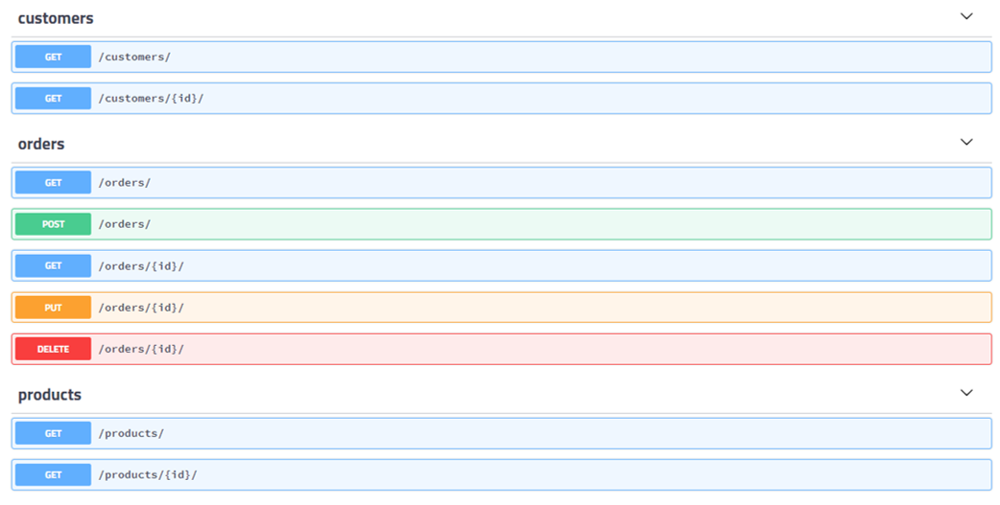

# store_wars_api
API Rest for Store Wars App.


## FRONTEND

O Frontend encontra-se no repositório [Star Wars](https://github.com/ewerton94/store_wars)
### Testando Localmente


#### para rodar pela primeira vez:

1. Instale o Python;
2. Instale as dependências:

```system
$ pip install -r requirements.txt
```
3. Altere a pasta do terminal para `store_wars` para que seja possível realizar as operações seguintes.

```system
$ cd store_wars
```

4. Crie um arquivo `store_wars/.env` com as seguintes informações:

```
SECRET_KEY=SUACHAVE
DEBUG=True
DB_ENGINE=django.db.backends.sqlite3
# These values can be located on PythonAnywhere Databases tab.
DB_HOST=localhost
DB_USER=SEUUSER
DB_PASSWORD=SUASENHA
DB_NAME='db.sqlite3'
#DB_PORT=3306
```

5. Atualize o banco de dados:

```system

$ python manage.py migrate

```

6. Crie um usuário admin (Caso seja necessário criar clientes ou produtos):

```system

$ python manage.py createsuperuser

```
7. Teste a aplicação:

```system

$ python manage.py test

```


#### Para rodar o servidor local (É necessário toda vez que for testar a aplicação)

```system

$ python manage.py runserver

```
